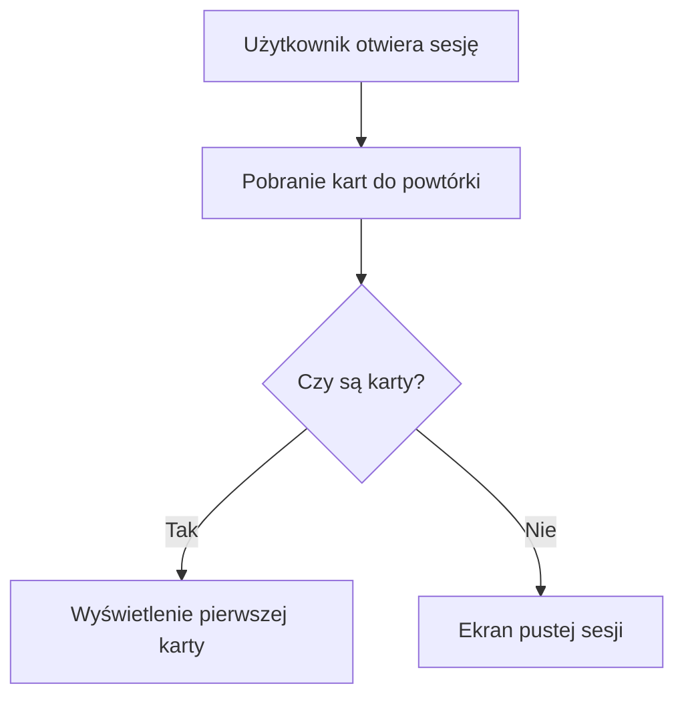
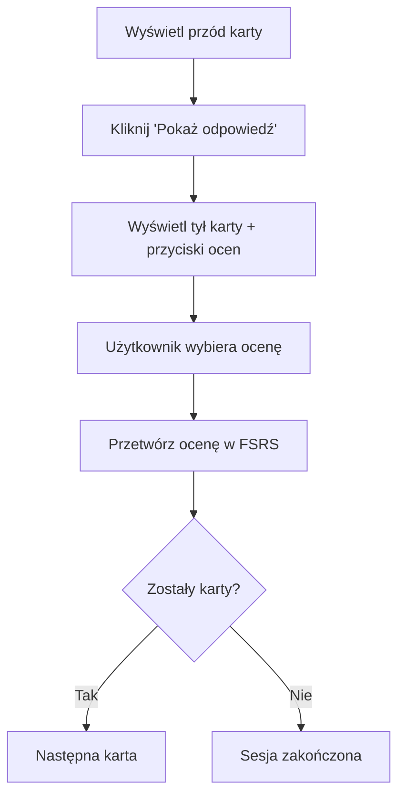

# 📚 Sesja Nauki - Algorytm FSRS

## Przegląd

Sesja nauki to interaktywny system nauki fiszek wykorzystujący algorytm FSRS (Free Spaced Repetition Scheduler) do optymalizacji procesu powtarzania. Użytkownicy przeglądają fiszki, oceniają swoją wiedzę i otrzymują spersonalizowane harmonogramy powtórek.

---

## 📑 Spis Treści

- [Jak Działa Algorytm FSRS](#jak-działa-algorytm-fsrs)
- [Stany Fiszek](#stany-fiszek)
- [Oceny Wiedzy](#oceny-wiedzy)
- [Przepływ Sesji Nauki](#przepływ-sesji-nauki)
- [Zarządzanie Kartami](#zarządzanie-kartami)
- [Statystyki i Metryki](#statystyki-i-metryki)
- [Architektura Techniczna](#architektura-techniczna)

---

## 🧠 Jak Działa Algorytm FSRS

### Co to jest FSRS?

FSRS (Free Spaced Repetition Scheduler) to nowoczesny algorytm spaced repetition oparty na badaniach psychologicznych. W przeciwieństwie do tradycyjnych systemów jak Anki, FSRS używa zaawansowanych modeli matematycznych do optymalizacji odstępów między powtórkami.

### Kluczowe Zalety FSRS

- **Nauka adaptacyjna**: Algorytm dostosowuje się do indywidualnego tempa nauki
- **Optymalizacja czasu**: Minimalizuje czas poświęcony na powtórki
- **Predykcja zapominania**: Oblicza prawdopodobieństwo zapomnienia
- **Skuteczność długoterminowa**: Zapewnia trwałe zapamiętywanie

### Parametry Algorytmu

```typescript
interface FSRSCard {
  due: Date;              // Następny termin powtórki
  stability: number;      // Stabilność pamięci (dni)
  difficulty: number;     // Trudność fiszki (0-10)
  elapsed_days: number;   // Dni od ostatniej powtórki
  scheduled_days: number; // Zaplanowane dni do następnej powtórki
  reps: number;           // Liczba powtórek
  lapses: number;         // Liczba zapomnień
  state: FSRSState;       // Stan fiszki
  last_review: Date;      // Data ostatniej powtórki
}
```

---

## 🎯 Stany Fiszek

### Typy Stanów

| Stan | Opis | Kolor |
|------|------|-------|
| **New** | Nowa fiszka, nigdy nie przeglądana | 🔵 Niebieski |
| **Learning** | W fazie początkowej nauki | 🟡 Żółty |
| **Review** | Regularne powtórki | 🟢 Zielony |
| **Relearning** | Ponowna nauka po zapomnieniu | 🟠 Pomarańczowy |

### Transition między Stanami

```
New → Learning → Review ↔ Relearning
    ↓         ↓           ↓
   (Pierwsza ocena)    (Regularne powtórki)
```

### Kryteria Przejść

- **New → Learning**: Po pierwszej ocenie (dowolna ocena)
- **Learning → Review**: Po 2-3 dobrych ocenach z rzędu
- **Review → Relearning**: Po ocenie "Again" (trudne przypomnienie)
- **Relearning → Review**: Po pomyślnej ponownej nauce

---

## ⭐ Oceny Wiedzy

### Skala Ocen

| Ocena | Wartość | Opis | Przykład użycia |
|-------|---------|------|-----------------|
| **Again** | 1 | Całkowite zapomnienie | Nie pamiętam w ogóle |
| **Hard** | 2 | Trudne przypomnienie | Pamiętam po dłuższym namyśle |
| **Good** | 3 | Poprawne przypomnienie | Pamiętam bez problemów |
| **Easy** | 4 | Łatwe przypomnienie | Pamiętam natychmiast |

### Wpływ Ocen na Harmonogram

```typescript
// Przykład wpływu ocen na stabilność
const ratingImpact = {
  1: { stability: -0.5, difficulty: +0.2 }, // Again - zmniejsza stabilność
  2: { stability: -0.2, difficulty: +0.1 }, // Hard - niewielki spadek
  3: { stability: +0.1, difficulty: -0.1 }, // Good - lekka poprawa
  4: { stability: +0.3, difficulty: -0.2 }, // Easy - znacząca poprawa
};
```

### Algorytm Dostosowywania

1. **Aktualizacja trudności**: Na podstawie oceny użytkownika
2. **Obliczenie stabilności**: Uwzględnia trudność i historię ocen
3. **Przewidywanie terminu**: Następna powtórka = obecny czas + stabilność

---

## 🔄 Przepływ Sesji Nauki

### Rozpoczęcie Sesji



### Przepływ Pojedynczej Karty



### Zakończenie Sesji

Po zakończeniu wszystkich kart do powtórki, użytkownik może:

1. **Rozpocząć nową sesję** - jeśli pojawią się nowe karty
2. **Przejść do innych funkcji** - generowanie, zarządzanie fiszkami
3. **Wyświetlić statystyki** - przegląd postępów nauki

---

## 🎛️ Zarządzanie Kartami

### Pobieranie Kart do Powtórki

```typescript
// Pobierz karty wymagające powtórki
async getDueCards(userId: string, limit = 20): Promise<StudyCardDto[]> {
  const now = new Date().toISOString();

  // Karty z istniejącymi logami powtórek
  const dueExistingCards = await supabase
    .from("review_logs")
    .select("*, flashcards:*")
    .eq("user_id", userId)
    .lte("due", now)  // due <= now
    .order("due", { ascending: true })
    .limit(limit);

  // Nowe karty (bez logów powtórek)
  const newCards = await supabase
    .from("flashcards")
    .select("*")
    .eq("user_id", userId)
    .not("id", "in", `(${existingCardIds})`)
    .order("created_at", { ascending: false })
    .limit(limit - dueExistingCards.length);

  return [...dueExistingCards, ...newCards];
}
```

### Struktura Danych Karty

```typescript
interface StudyCardDto {
  flashcard: FlashcardDto;
  reviewLog?: ReviewLogDto;
  state: CardState;
  due: string;
  stability: number;
  difficulty: number;
}
```

### Obsługa Ocen

```typescript
async submitReview(userId: string, flashcardId: number, rating: Rating) {
  // 1. Pobierz istniejący log powtórki
  const existingLog = await getReviewLog(userId, flashcardId);

  // 2. Utwórz kartę FSRS
  const fsrsCard = existingLog ? cardFromReviewLog(existingLog) : createEmptyCard();

  // 3. Zastosuj ocenę do algorytmu
  const updatedCard = fsrs.repeat(fsrsCard, new Date())[ratingToFSRS(rating)];

  // 4. Zapisz nowy log powtórki
  await saveReviewLog({
    user_id: userId,
    flashcard_id: flashcardId,
    rating: rating,
    state: updatedCard.card.state,
    due: updatedCard.card.due,
    stability: updatedCard.card.stability,
    difficulty: updatedCard.card.difficulty,
    elapsed_days: updatedCard.card.elapsed_days,
    scheduled_days: updatedCard.card.scheduled_days,
    reps: updatedCard.card.reps,
    lapses: updatedCard.card.lapses,
  });
}
```

---

## 📊 Statystyki i Metryki

### Tabela Review Logs

```sql
CREATE TABLE review_logs (
  id SERIAL PRIMARY KEY,
  user_id UUID NOT NULL,
  flashcard_id INTEGER NOT NULL,
  rating INTEGER NOT NULL CHECK (rating >= 1 AND rating <= 4),
  state INTEGER NOT NULL,
  due TIMESTAMP NOT NULL,
  stability REAL NOT NULL,
  difficulty REAL NOT NULL,
  elapsed_days REAL NOT NULL,
  scheduled_days REAL NOT NULL,
  reps INTEGER NOT NULL DEFAULT 0,
  lapses INTEGER NOT NULL DEFAULT 0,
  reviewed_at TIMESTAMP DEFAULT NOW(),
  created_at TIMESTAMP DEFAULT NOW(),

  FOREIGN KEY (flashcard_id) REFERENCES flashcards(id) ON DELETE CASCADE,
  UNIQUE(user_id, flashcard_id) -- Jeden log na użytkownika i fiszkę
);
```

### Kluczowe Metryki

#### Poziom Indywidualnej Karty

- **Stabilność**: Jak długo informacja zostaje w pamięci
- **Trudność**: Jak ciężko jest zapamiętać tę fiszkę
- **Liczba powtórek**: Ile razy karta była przeglądana
- **Liczba zapomnień**: Ile razy użytkownik wybrał "Again"

#### Statystyki Sesji

- **Czas trwania**: Ile czasu zajęła sesja
- **Liczba kart**: Ile kart zostało przejrzanych
- **Średnia ocena**: Jak dobrze użytkownik sobie radził
- **Czas na kartę**: Średni czas poświęcony na jedną kartę

#### Długoterminowe Metryki

- **Łączna liczba powtórek**: Wszystkie sesje
- **Procent poprawnych odpowiedzi**: Ogólna skuteczność
- **Trend stabilności**: Czy wiedza się poprawia

---

## 🏗️ Architektura Techniczna

### Komponenty

#### Frontend

```typescript
// StudySessionView.tsx - Główny komponent UI
export function StudySessionView() {
  const { fetchDueCards, submitReview } = useStudySession();

  // Stan lokalny
  const [cards, setCards] = useState<StudyCardDto[]>([]);
  const [currentIndex, setCurrentIndex] = useState(0);
  const [showBack, setShowBack] = useState(false);

  // Logika nawigacji
  const handleRating = useCallback(async (rating: Rating) => {
    await submitReview(cards[currentIndex].flashcard.id, rating);

    if (currentIndex < cards.length - 1) {
      setCurrentIndex(currentIndex + 1);
      setShowBack(false);
    } else {
      setSessionComplete(true);
    }
  }, [submitReview, cards, currentIndex]);
}
```

#### API Endpoints

```typescript
// GET /api/study-session - Pobierz karty do powtórki
export const GET: APIRoute = async ({ locals, url }) => {
  const limit = parseInt(url.searchParams.get("limit") || "20");
  const studySessionService = new StudySessionService(locals.supabase);
  const dueCards = await studySessionService.getDueCards(locals.user.id, limit);

  return jsonResponse({ cards: dueCards });
};

// POST /api/study-session - Prześlij ocenę
export const POST: APIRoute = async ({ request, locals }) => {
  const { flashcard_id, rating } = await request.json();

  const studySessionService = new StudySessionService(locals.supabase);
  const result = await studySessionService.submitReview(locals.user.id, flashcard_id, rating);

  return jsonResponse({ success: true, ...result });
};
```

#### Backend Service

```typescript
// StudySessionService.ts - Logika biznesowa
export class StudySessionService {
  private fsrsScheduler = fsrs();

  async getDueCards(userId: string, limit = 20): Promise<StudyCardDto[]> {
    // Logika pobierania kart wymagających powtórki
  }

  async submitReview(userId: string, flashcardId: number, rating: Rating) {
    // Logika przetwarzania oceny i aktualizacji FSRS
  }
}
```

### Schemat Bazy Danych

```sql
-- Tabela fiszek
CREATE TABLE flashcards (
  id SERIAL PRIMARY KEY,
  user_id UUID NOT NULL,
  front TEXT NOT NULL,
  back TEXT NOT NULL,
  source TEXT NOT NULL DEFAULT 'manual',
  generation_id INTEGER,
  created_at TIMESTAMP DEFAULT NOW(),
  updated_at TIMESTAMP DEFAULT NOW()
);

-- Tabela logów powtórek (FSRS data)
CREATE TABLE review_logs (
  id SERIAL PRIMARY KEY,
  user_id UUID NOT NULL,
  flashcard_id INTEGER NOT NULL,
  rating INTEGER NOT NULL,
  state INTEGER NOT NULL,
  due TIMESTAMP NOT NULL,
  stability REAL NOT NULL,
  difficulty REAL NOT NULL,
  elapsed_days REAL NOT NULL,
  scheduled_days REAL NOT NULL,
  reps INTEGER NOT NULL DEFAULT 0,
  lapses INTEGER NOT NULL DEFAULT 0,
  reviewed_at TIMESTAMP DEFAULT NOW(),
  created_at TIMESTAMP DEFAULT NOW(),

  FOREIGN KEY (flashcard_id) REFERENCES flashcards(id) ON DELETE CASCADE
);
```

---

## 🧪 Testowanie

### Testy Jednostkowe

```typescript
// Test algorytmu FSRS
describe("StudySessionService", () => {
  it("should calculate correct due date for 'Good' rating", () => {
    const card = createEmptyCard();
    const result = fsrs.repeat(card, new Date())[Rating.Good];

    expect(result.card.due).toBeInstanceOf(Date);
    expect(result.card.stability).toBeGreaterThan(card.stability);
  });
});
```

### Testy E2E

```typescript
// Kompletny przepływ sesji nauki
test("complete study session workflow", async ({ page }) => {
  // 1. Przejdź do sesji nauki
  // 2. Sprawdź czy są karty do powtórki
  // 3. Przejrzyj fiszki i oceń wiedzę
  // 4. Sprawdź czy oceny są zapisywane
  // 5. Sprawdź zakończenie sesji
});
```

### Test Data

System używa specjalnych testowych fiszek do zapewnienia spójności testów E2E.

---

## 🚀 Optymalizacje Przyszłe

### Wydajność

- **Pagination**: Ładowanie kart partiami dla długich sesji
- **Offline Mode**: Synchronizacja ocen gdy brak internetu
- **Progressive Loading**: Ładowanie fiszek w tle podczas przeglądania

### Funkcjonalność

- **Session Statistics**: Szczegółowe statystyki sesji
- **Custom Intervals**: Możliwość dostosowania odstępów
- **Deck Management**: Organizowanie fiszek w talie
- **Import/Export**: Migracja danych między urządzeniami

### Personalizacja

- **Difficulty Adjustment**: Dynamiczna korekta trudności
- **Time Preferences**: Nauka o różnych porach dnia
- **Goal Setting**: Cele dzienne/tygodniowe

---

## 📚 Dodatkowe Zasoby

- [FSRS Algorithm Paper](https://github.com/open-spaced-repetition/fsrs) - Szczegóły algorytmu
- [ts-fsrs Library](https://github.com/open-spaced-repetition/ts-fsrs) - Implementacja TypeScript
- [Spaced Repetition Research](https://www.gwern.net/Spaced-repetition) - Badania naukowe

---

**Ostatnia aktualizacja**: 2024-11-13
**Status**: ✅ Kompletna implementacja
**Algorytm**: FSRS v4.5
